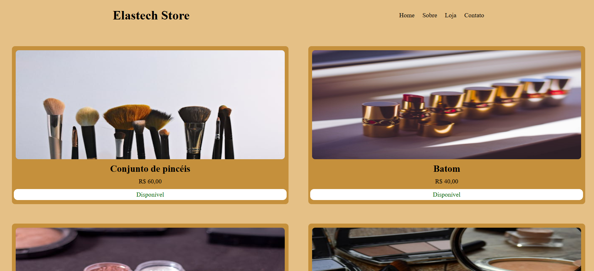

# 🛍️ ElasTech Store  

## 📖 Sobre o Projeto  

O **ElasTech Store** é um projeto desenvolvido como parte do **Desafio do Bootcamp Pagbank** em parceria com a **SoulCode Academy**.  
O objetivo foi criar uma **página estática** utilizando **HTML**, **CSS** e **JavaScript**, colocando em prática conceitos básicos de **Flexbox** e **Grid Layout** para construir um layout responsivo, moderno e funcional.  

---

## 🎯 Objetivos do Desafio  

✅ Praticar **HTML semântico**  
✅ Utilizar **Flexbox** e **CSS Grid** para organização de layout  
✅ Desenvolver um **design responsivo**  
✅ Implementar interatividade com **JavaScript básico**  

---

## 🖥️ Tecnologias Utilizadas  

[](#)
[](#)
[](#)

---

## 📌 Funcionalidades  

- 📱 **Layout responsivo** adaptado para mobile, tablet e desktop  
- 🎯 Estrutura visual limpa e intuitiva  
- ✨ Pequenas interações para melhorar a experiência do usuário  

---

## 👩🏻‍💻 Resultado Final
 

## 🚀 Como Executar o Projeto  

1. **Clone** o repositório:  
   ```bash
   git clone https://github.com/usuario/elastech-store-desafio-bootcamp-pagbank.git

2. Acesse a pasta do projeto:

```bash cd exercicio-revisao```

3. Abra o arquivo index.html no seu navegador preferido.

# 📂 Estrutura de Pastas

```exercicio-revisao/
│
├── index.html   # Página principal
├── style.css    # Arquivo de estilos
├── script.js    # Funções e interações em JavaScript
└── img/         # Pasta onde tem as imagens utilizadas no projeto
```

# 👩‍💻 Equipe

- [Maria de Fátima (@alvesmariadefatima)](https://github.com/alvesmariadefatima)
- [Victoria Mafra (@torimafra)](https://github.com/torimafra)
- Beatriz Balestrieiro
---
💡 Projeto desenvolvido para fins educacionais durante o Bootcamp **Pagbank** em parceria com a **SoulCode Academy**.